# 📚 PyLearn - Learning Platform for Python Programming

## 📖 Overview

PyLearn is a web-based learning platform designed to help students learn Python programming through interactive lessons, quizzes, and practical learning modules. The system provides a user-friendly interface for both learners and administrators to manage courses and track learning progress.

---

## 🚀 Features

* 👤 User Registration and Login
* 📚 Python Learning Modules
* 📝 Interactive Quizzes
* 📊 Progress Tracking
* 🎓 Course Management
* 📱 Responsive User Interface
* 👨‍💼 Admin Dashboard

---

## 🛠️ Technologies Used

### Frontend

* HTML5
* CSS3
* Bootstrap
* JavaScript
* AJAX

### Backend

* PHP

### Database

* MySQL

### Server

* XAMPP (Apache + MySQL)

---


---

## ⚙️ Installation

1. Install XAMPP.
2. Copy the project folder to the `htdocs` directory.
3. Start Apache and MySQL from the XAMPP Control Panel.
4. Import the MySQL database using phpMyAdmin.
5. Open your browser and visit:

```
http://localhost/PyLearn
```

---


## 📸 Project Screenshots


### 🏠 Home Page
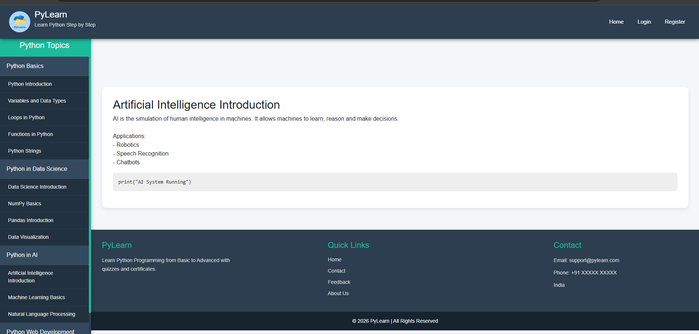

### 🔐 Login Page
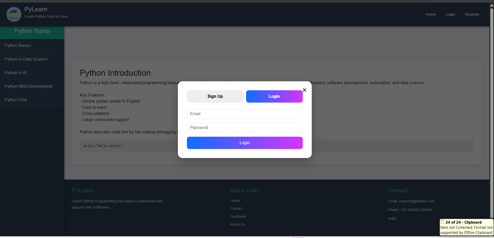

### 📝 Sign Up Page
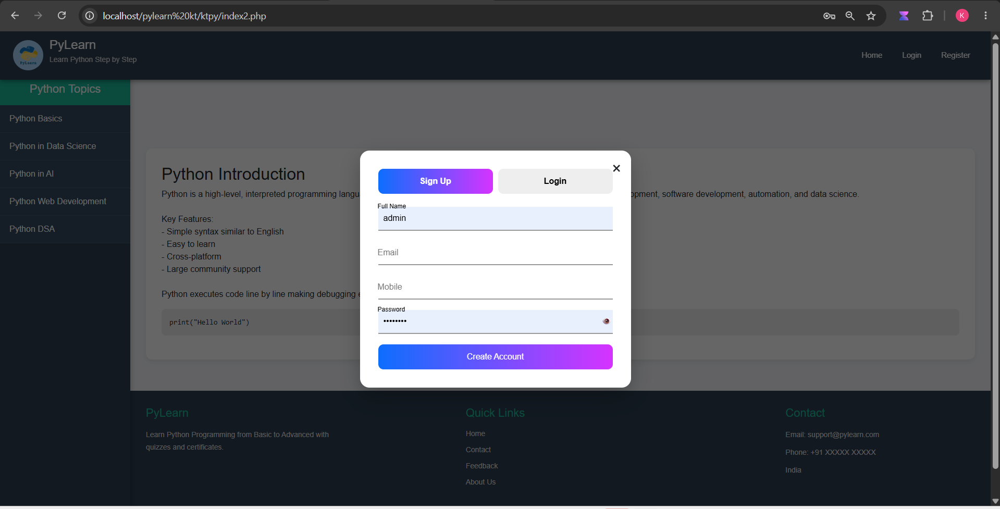

### ✅ Registration Successful
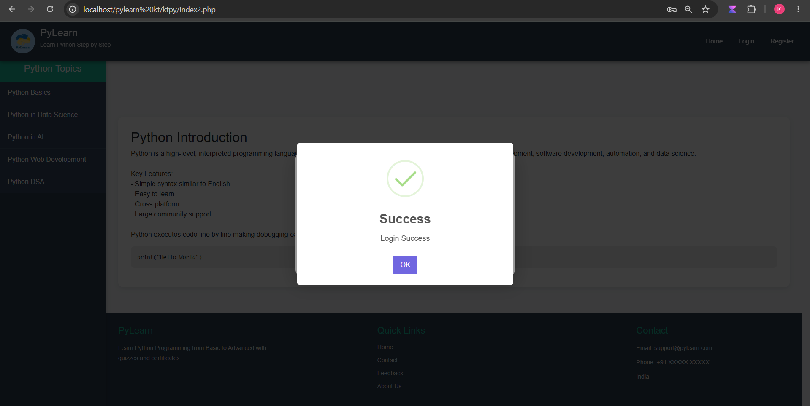

### 👨‍🎓 Student Dashboard
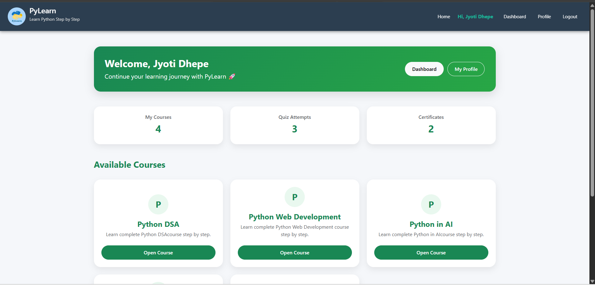

### 👤 Student Profile
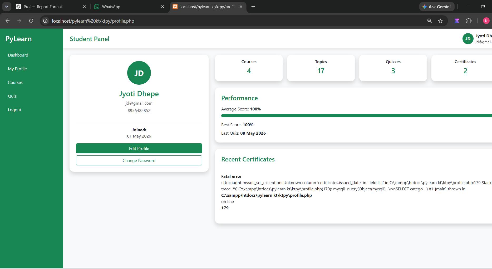

### 📚 Courses
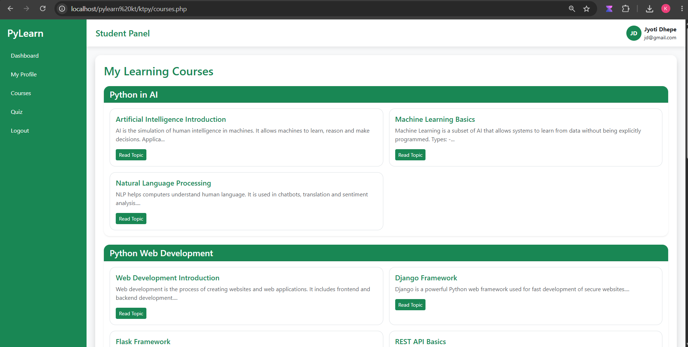

### 📝 Quiz
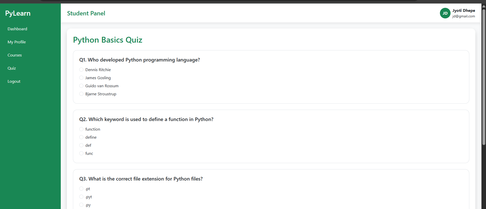

### 📊 Quiz Result
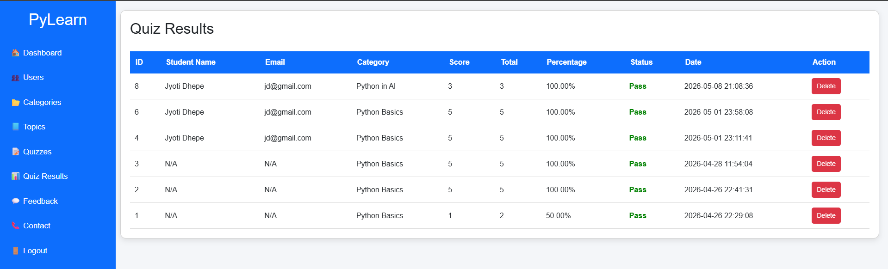

### 🎓 Certificates
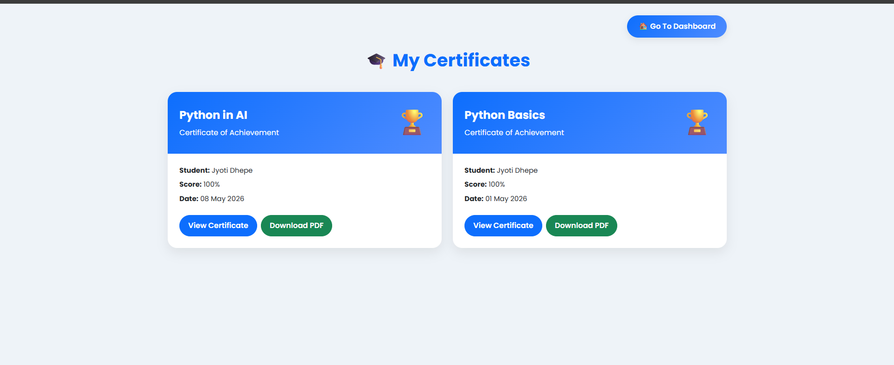

### 👨‍💼 Admin Login
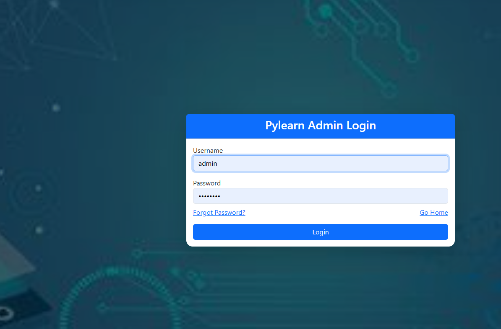

### 📈 Admin Dashboard
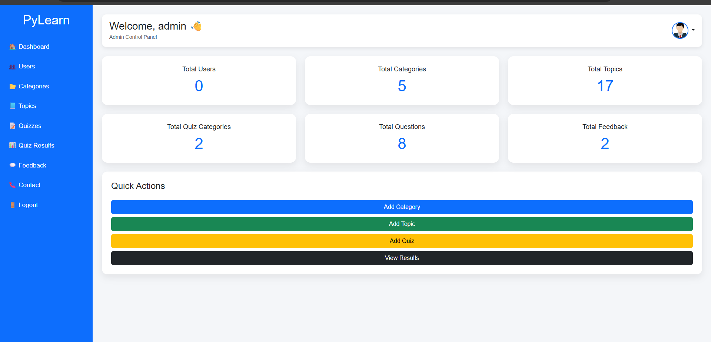

### 📞 Contact Management
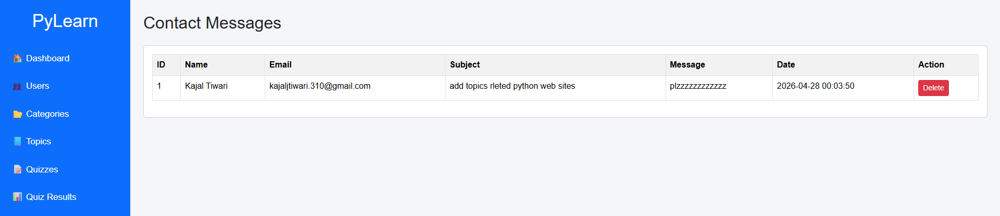

## 🎯 Future Enhancements

* AI-Based Learning Assistant
* Online Coding Compiler
* Video Tutorials
* Performance Analytics
* Dark Mode
* Mobile Application

---
Admin Dashboard 
user name :-admin
Password:- admin123

## 👨‍💻 Author

Kajal Tiwari

---


